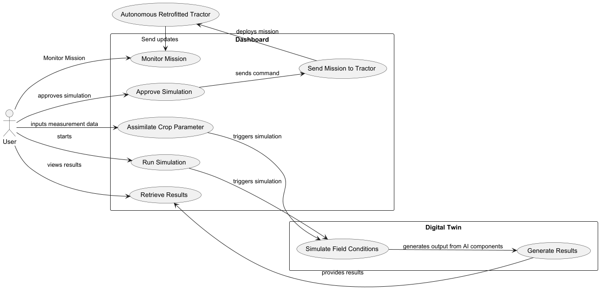
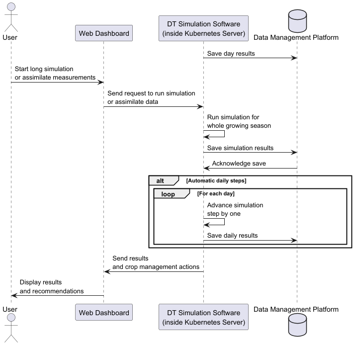

# Digital Twin Framework

### Overview
This repository contains the Digital Twin framework for real-time monitoring and management of agricultural environments, with a focus on precision farming. The framework leverages digital twins of crops and orchards to simulate conditions and provide data-driven recommendations for optimized pesticide and resource application. 

### Features
- **Digital Twin Simulation**: Models crop and/or pest growth and environmental interactions. Currently, two digital twins are implemented:
  - *Fertilizer Management for Winter Wheat*: Utilizes the [PCSE framework](https://pcse.readthedocs.io/en/stable/) to simulate crop growth and nutrient needs.
  - *Apple Scab Management for Apple Orchards*: Employs [A-scab](https://github.com/BigDataWUR/A-scab) to simulate disease spread and inform pesticide application.
- **Crop Management**: Reinforcement learning (RL) models predict optimal pesticide and fertilizer applications based on crop conditions and environmental factors.
- **Scalable Deployment**: Containerized components are deployed on Kubernetes, allowing for scalable operations.
- **Data Interfacing**: Integrates the [Smart Droplets Data Adaptor](https://github.com/Smart-Droplets-Project/smartDropletsDataAdapters) and [FIWARE's Orion Context Broker](https://fiware-orion.readthedocs.io/en/master/) to handle and route data between various applications.

## Installation

The digitalTwinFramework is installed in a Kubernetes cluster. Instructions for deploying the framework can be found in the installation guide at [INSTALL.md](INSTALL.md).

## Usage

Demo scripts are provided to illustrate the framework’s core functionalities. Instructions on how to run these scripts are provided in [INSTALL.md](INSTALL.md), which calls [demo.sh](demo.sh). Dependency management and script execution are managed through [Poetry](https://python-poetry.org/).

* [demo.py](digitaltwin/demo.py): Initializes a parcel with a crop and simulates a growing season in daily timesteps, generating fertilization recommendations. Simulation results as well as fertilizer recommendations (command messages) are stored in the data management platform through the context broker.
* [demo-ascab.py](digitaltwin/demo-ascab.py): Initializes a parcel with apple trees that may be infected with apple scab. It runs simulations of potential infections and provides spraying suggestions (command messages), storing outcomes in the data management platform.
* [demo-receive-notification.py](digitaltwin/demo-receive-notification.py): Demonstrates how an [upload of a measurement](digitaltwin/demo-upload-measurement.py) triggers a simulation run. This is enabled by FastAPI, which is subscribed to notifications from the context broker.

## Use Case
The Digital Twins are part of the Smart Droplets Digital Platform. The use case of the Framework is shown in the UML figure below:

The Digital Twins automatically simulates a new day based on the [Cron Job](https://kubernetes.io/docs/concepts/workloads/controllers/cron-jobs/) defined.
A user may also invoke a simulation for the whole growing season.
We explain the inter-component interaction with a sequence diagram below:

