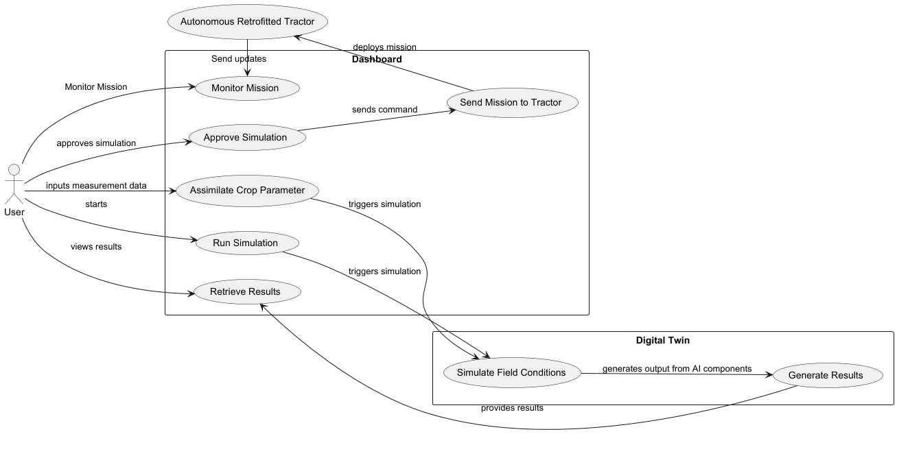
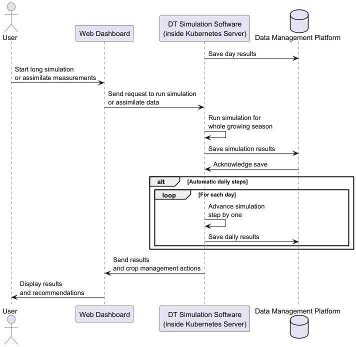

# Digital Twin Framework

This repository contains the Digital Twin (DT) framework of the [Smart Droplets](https://smartdroplets.eu/) project (Horizon Europe grant agreement 101070496). It provides digital twins of crops and orchards for monitoring, simulation, and data-driven recommendations on pesticide and fertiliser application.

This is a **research and pilot framework**, not a packaged farm decision-support product. See [Maturity](#maturity) below.

### Features
- **Digital Twin Simulation**: Models crop and/or pest growth and environmental interactions. Currently, two digital twins are implemented:
  - *Fertilizer Management for Winter Wheat*: Utilizes the [PCSE framework](https://pcse.readthedocs.io/en/stable/) to simulate crop growth and nutrient needs.
  - *Apple Scab Management for Apple Orchards*: Employs [A-scab](https://github.com/WUR-AI/A-scab) to simulate disease spread and inform pesticide application.
- **Crop Management**: Reinforcement learning (RL) models predict optimal pesticide and fertilizer applications based on crop conditions and environmental factors.
- **Scalable Deployment**: Containerized components are deployed on Kubernetes, allowing for scalable operations.
- **Data Interfacing**: Integrates the [Smart Droplets Data Adaptor](https://github.com/Smart-Droplets-Project/smartDropletsDataAdapters) and [FIWARE's Orion Context Broker](https://fiware-orion.readthedocs.io/en/master/) to handle and route data between various applications.

## Key Exploitable Result

This repository is the public software artefact of **KER 7 (Digital Twin)**, owned by Wageningen University & Research (WU). Through the NGSI-LD adapters it is also a component of **KER 6 (Software Solution)**, jointly owned by EUT, AUA, WU and VLF.

| KER | This repository | Protection | Exploitation |
| --- | --- | --- | --- |
| KER 7 Digital Twin | Source, demos, trained ONNX agents, pilot narratives | Copyright; Apache-2.0 for the public research core | Open scientific reuse; further R&I; optional service/licensing layer |
| KER 6 Software Solution | Integration with Orion via `smartDropletsDataAdapters` | Copyright on this code (Apache-2.0); KER 6 as a whole follows the consortium Hybrid Licensing Model | Interoperability component of the digital platform |

GitHub publication is **dissemination and open reuse**, not a product-distribution channel and not a substitute for the IPR measures in deliverable D6.8.

## Maturity

This component is at approximately **TRL 6**: architecture and models were demonstrated in the Spanish (apple orchard) and Lithuanian (winter wheat) pilot environments. It is not TRL 8/9: there is no production SLA, no packaged commercial DSS, and no multi-farm operational qualification.

**Demonstrated in the pilots**

- Winter wheat: WOFOST/PCSE with data assimilation; flowering date within four days of the field observation; LAI compared with Sentinel-2; RL nitrogen recommendations compared with agronomist practice. Details: [data/pilots](data/pilots).
- Apple scab: A-scab infection risk compared with RIMpro; RL spray timing and count compared with standard orchard practice. Details: [data/pilots](data/pilots).
- Platform integration: simulation results and command messages stored in the data management platform through the Orion Context Broker; Kubernetes deployment via [sd-cloud-k8s](https://github.com/Smart-Droplets-Project/sd-cloud-k8s).

**Not claimed**

- Season-long closed-loop control of the tractor by the DT in unrestricted commercial use.
- Production-grade readiness of the integrated Smart Droplets software stack.

Higher maturity would require further testing and validation in real-world operational settings (multi-season, multi-farm). No additional development is committed in this repository beyond maintaining the public research core.

## Installation

### Kubernetes (project deployment)

The digitalTwinFramework is to be installed in a Kubernetes cluster. Instructions for deploying the framework can be found in the installation guide at the [repository for SmartDroplets Kubernetes Deployment](https://github.com/Smart-Droplets-Project/sd-cloud-k8s).

### Local development

Dependency management is handled with [Poetry](https://python-poetry.org/).

```bash
git clone https://github.com/Smart-Droplets-Project/digitalTwinFramework.git
cd digitalTwinFramework
poetry install
```

Demos that write to the context broker need a local Orion instance (default `localhost:1026`). See [contextBrokerExamples](https://github.com/Smart-Droplets-Project/contextBrokerExamples).

```bash
poetry run python digitaltwin/demo.py --host localhost
poetry run python digitaltwin/demo-ascab.py --host localhost
```

## Usage

Demo scripts are provided to illustrate the framework’s core functionalities.

* [demo.py](digitaltwin/demo.py): Initializes a parcel with a crop and simulates a growing season in daily timesteps, generating fertilization recommendations. Simulation results as well as fertilizer recommendations (command messages) are stored in the data management platform through the context broker.
* [demo-ascab.py](digitaltwin/demo-ascab.py): Initializes a parcel with apple trees that may be infected with apple scab. It runs simulations of potential infections and provides spraying suggestions (command messages), storing outcomes in the data management platform.
* [demo-receive-notification.py](digitaltwin/demo-receive-notification.py): Demonstrates how an [upload of a measurement](digitaltwin/demo-upload-measurement.py) triggers a simulation run. This is enabled by FastAPI, which is subscribed to notifications from the context broker.

Cluster-oriented helpers: [demo.sh](demo.sh) and the [Dockerfile](Dockerfile).

## Use Case
The Digital Twins are part of the Smart Droplets Digital Platform. The use case of the Framework is shown in the UML figure below:


The Digital Twins automatically simulates a new day.
A user may also invoke a simulation for the whole growing season.
We explain the inter-component interaction with a sequence diagram below:


## Data
* [Pilot narratives and figures](data/pilots) document what was demonstrated at the Spanish and Lithuanian sites. They do not include raw farm records.
* [Example simulation outputs](data/sample) are small CSV extracts for the winter-wheat twin.
* Trained agents (ONNX) are included:
  * [AI fertilizer agent](digitaltwin/cropmodel/configs/AI_fertilizer_agent)
  * [AI pesticide agent](digitaltwin/ascabmodel/AI_pesticide_agent)

Training trajectories for the RL agents are not published here (method: Baja et al., 2025). Sentinel-2 scenes and grower operational records remain with the original providers.

## Publications

Please cite the architecture paper if you use this software:

- Kallenberg, M., Baja, H., Ilić, M., Tomčić, A., Tošić, M., & Athanasiadis, I. N. (2025). Interoperable agricultural digital twins with reinforcement learning intelligence. *Smart Agricultural Technology*, 12, 101412. https://doi.org/10.1016/j.atech.2025.101412
- Baja, H., Kallenberg, M. G. J., Berghuijs, H. N. C., & Athanasiadis, I. N. (2025). Adaptive fertilizer management for optimizing nitrogen use efficiency with constrained reinforcement learning. *Computers and Electronics in Agriculture*, 237, 110554. https://doi.org/10.1016/j.compag.2025.110554
- Baja, H., Kallenberg, M., & Athanasiadis, I. N. (2025). To Measure or Not: A Cost-Sensitive, Selective Measuring Environment for Agricultural Management Decisions with Reinforcement Learning. *Proceedings of the AAAI Conference on Artificial Intelligence*, 39(27), 27831–27840. https://doi.org/10.1609/aaai.v39i27.34999

Related model: [A-scab](https://github.com/WUR-AI/A-scab).

## License

Copyright 2023-2026 Wageningen University & Research.

Licensed under the Apache License, Version 2.0. See [LICENSE](LICENSE) and [NOTICE](NOTICE).
