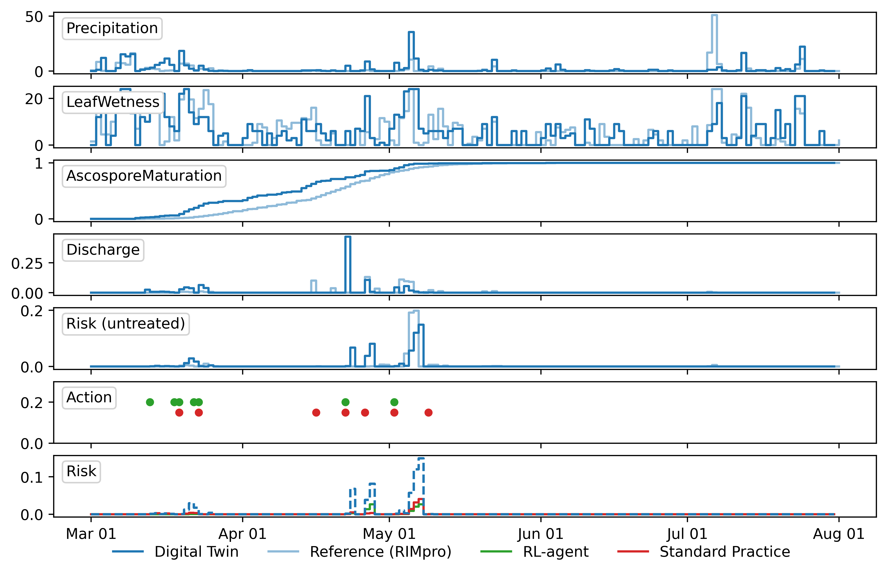
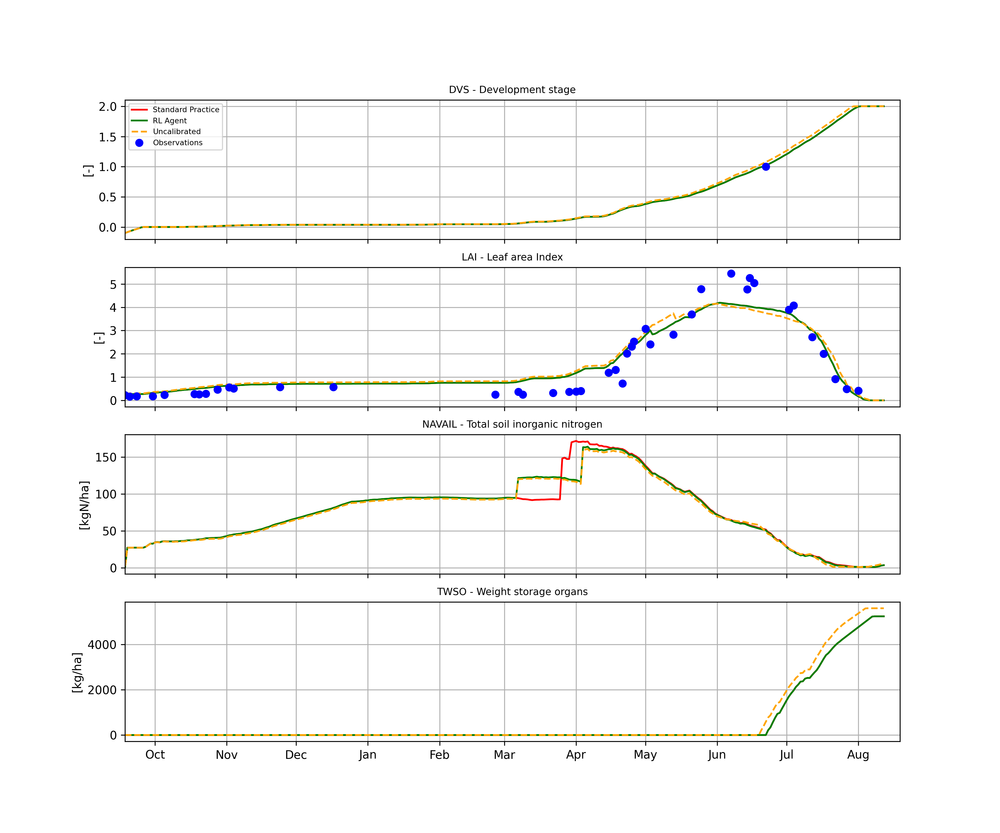

# Digital Twin & Reinforcement Learning Pilot Studies

This repository showcases pilot studies of digital twin models powered by reinforcement learning (RL) for crop management. Preliminary results are presented for apple and winter wheat crops from the 2024–2025 growing season.

---

## Apple Pilot

For apples, we used a pretrained RL agent trained and evaluated across diverse orchard conditions in silico. The agent learned strategies that manage disease risk effectively while minimizing pesticide use, rivaling conventional practices.

### Model Performance & Comparison

Figure 1 shows the progression of apple scab over time. Our digital twin is benchmarked against the established decision support tool RIMpro [Trapman, 1997], which the local orchard manager uses to guide spraying decisions. Apple scab infections are initiated by discharge events triggered by rainfall, with infection load influenced by available ascospores. Spore maturation, dependent on favorable weather (temperature and rainfall), is predicted by the digital twin. Overall, the model reproduces the timing of discharge events and associated infection risk reasonably well compared to RIMpro. Some discrepancies may arise from differences in weather data sources between the systems.

### Management Actions

In practice, standard management combines RIMpro recommendations with rainfall-driven spraying: fungicides are applied prior to anticipated rainfall and reapplied after significant rainfall or plant growth [ONFruit, 2023]. The RL agent recommended a similar number of sprays, with timing closely aligned with standard practice. Total dose was marginally higher, yet the estimated cumulative infection risk was slightly lower, suggesting that our RL-powered digital twin can provide effective, automated, data-driven guidance.

*Figure 1: Apple scab progression over the 2024–2025 season. Top rows: model validation comparing infection dynamics predicted by the digital twin against RIMpro. Bottom rows: management actions and resulting risk, contrasting RL-recommended spraying with standard practice.*

---

## Winter Wheat Pilot

For winter wheat, we employed a pretrained RL agent whose training and validation are described in detail in [Baja et al., 2025](#). The agent was extensively evaluated across diverse field conditions and consistently outperformed standard practices for nitrogen use efficiency in silico.

### Model Performance

Figure 2 shows simulated and observed crop development for one digital twin. Observations were obtained automatically, with manual input only for anthesis dates. The predicted flowering date (18 June 2025) closely matched the observed date (22 June 2025). Leaf Area Index (LAI) was estimated from Sentinel-2 L2A imagery using the SNAP BioPhysS2tbx neural network [Weiss et al., 2020]. Onset and senescence of leaf area were simulated accurately, although the digital twin underestimated maximum LAI (4.1 vs. 5.4).

### Management Actions

The RL agent recommended two in-season fertilization events: 5 March 2025 40 kg N/ha and 2 April 2025 70 kg N/ha, while local agronomists suggested 24 March 2025 80 kg N/ha and 28 March 2025 30 kg N/ha. With comparable total nitrogen and timing, both approaches produced similar effects on crop development. This demonstrates that the RL-powered digital twin can replicate expert decisions while offering a consistent, automated, data-driven tool.

*Figure 2: Phenological development over time (top row). Simulated vs. satellite-derived LAI (2nd row). Nitrogen available to the crop, with mid-season fertilization peaks reflecting standard practice (red) and digital twin recommendations (green) (3rd row). Storage organ weight (yield) (bottom row). Dashed orange lines indicate uncalibrated simulation results for reference.*

---

## References

- Trapman, P. (1997). *Management of apple scab with RIMpro*.  
- ONFruit (2023). *Orchard spraying guidelines*.  
- Weiss, M., et al. (2020). *SNAP BioPhysS2tbx neural network for LAI estimation*.  
- Baja, H., et al. (2025). *Winter wheat RL agent for nitrogen optimization*.  
